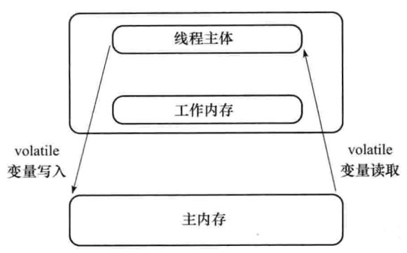
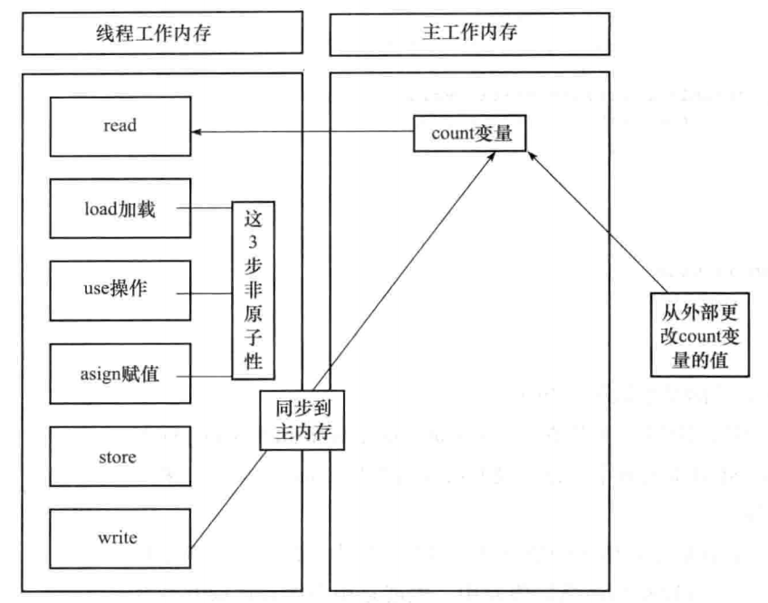
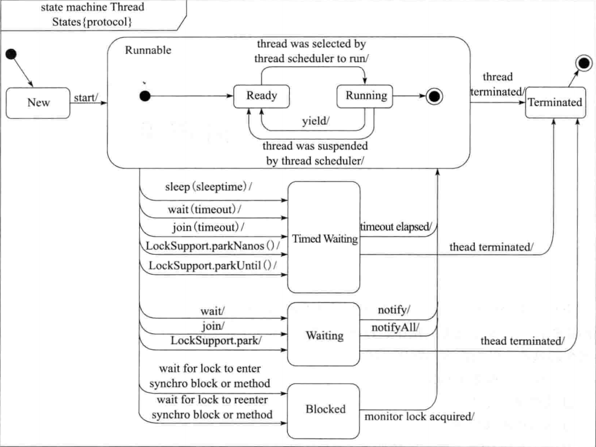

本文志在梳理多线程编程相关基础知识。包括：多线程的基本概念，线程同步的机制，线程间通信的实现，线程Lock的使用，定时器Timer，以及线程状态和线程组知识

### 基础知识

- 创建线程的两种方式:1,继承Thread类,2，实现Runnable接口。
- 一些线程API
    - isAlive()  测试线程是否处于活动状态 
    - sleep()  让“正在执行的线程”休眠
    - getId() 取得线程唯一标识
    - yield() 放弃当前的CPU资源
- 弃用的API,会产生数据不同步的情况
     - stop() java.lang.ThreadDeath
     - suspend()
     - resume()
- 停止线程的几种方式
    - 外部调用使用interrupt()中断线程 interrupted() isInterrupted() 测试是否中断
    - run()方法中使用异常 throw new Exception()
    - run()方法中使用return
- 线程优先级
    - 继承性:优先级继承
    - 随机性：优先级不等于优先执行
    - 规则性:CPU倾向于优先级高的
- 守护线程
    - 进程中不存在非守护线程时，守护线程自动销毁。典型例子如：垃圾回收线程。
- compare
    - Thread.currentThread() thread.getName()
    - sleep()和wait()区别
    - interrupted()和isInterrupted()
    
------------

### 对象和变量的并发访问
- synchronized
   - 调用用关键字synchronized声明的方法是排队运行的。但假如线程A持有某对象的锁，那线程B异步调用非synchronized类型的方法不受限制
   - synchronized锁重入:一个线程得到对象锁后，再次请求此对象锁时是可以得到该对象的锁的。同时，子类可通过“可重入锁”调用父类的同步方法。
   - 同步不具有继承性。
   - synchronized使用的“对象监视器”是一个，即必须是同一个对象
- synchronized同步方法和synchronized同步代码块。
   - 对其他synchronized同步方法或代码块调用呈阻塞状态。
   - 同一时间只有一个线程可执行synchronized方法/代码块中的代码
- synchronized(非this对象x)，将x对象作为“对象监视器”
   - 当多个线程同时执行synchronized(x){}同步代码块时呈同步效果
   - 当其他线程执行x对象中synchronizd同步方法时呈同步效果
   - 当其他线程执行x对象方法里的synchronized(this)代码块时呈同步效果
   - 静态同步synchronized方法与synchronized(class)代码块：对当前对应的class类进行持锁。
   - 线程的私有堆栈图
- volatile关键字
   - 主要作用是使变量在多个线程间可见。加volatile关键字可强制性从公共堆栈进行取值,而不是从线程私有数据栈中取得变量的值
   - 在方法中while循环中设置状态位(不加volatile关键字)，在外面把状态位置位改变并不可行，循环不会停止，比如JVM在-server模式。
- 原子类
   - 一个原子类型就是一个原子操作可用的类型，可在没有锁的情况下做到线程安全。但原子类也不是完全安全，虽然原子操作是安全的，可方法间的调用却不是原子的，需要用同步。

#### compare  
- synchronized静态方法与非静态方法
   - synchronized关键字加static静态方法上是给Class类上锁，可以对类的所有实例对象起作用
   - synchronized关键字加到非static静态方法上是给对象上锁，对该对象起作用。
- synchronized和volatile比较
   - 关键字volatile是线程同步的轻量级实现，性能比synchronized好，且volatile只能修饰变量，synchronized可修饰方法和代码块。
   - 多线程访问volatile不会发生阻塞，synchronized会出现阻塞
   - volatile能保证数据可见性，不保证原子性;synchronized可以保证原子性，也可以间接保证可见性，因为synchronized会将私有内存和公共内存中的数据做同步。
   - volatile解决的是变量在多个线程间的可见性，synchronized解决的是多个线程访问资源的同步性。 
- String常量池特性:故大多数情况下，synchronized代码块都不适用String作为锁对象。
- [ ] 多线程死锁:使用JDK自带工具，jps命令+jstack命令监测是否有死锁。`TODO`
- 内置类与静态内置类
- 锁对象的的改变
- 一个线程出现异常时，其所持有的锁会自动释放
- 
- 

### 线程间通信
- 等待/通知机制
  - wait()和notify()/notifyAll()。wait使线程停止运行，notify使停止的线程继续运行。
  - wait():将当前执行代码的线程进行等待，置入”预执行队列”。
     - 在调用wait()之前，线程必须获得该对象的对象级别锁；
     - 执行wait()方法后，当前线程立即释放锁；
     - 从wait()返回前，线程与其他线程竞争重新获得锁
     - 当线程呈wait()状态时，调用线程的interrup()方法会出现InterrupedException异常
     - wait(long):是等待某一时间内是否有线程对锁进行唤醒，超时则自动唤醒。
   - notify():通知可能等待该对象的对象锁的其他线程。随机挑选一个呈wait状态的线程，使它等待获取该对象的对象锁。
     - 在调用notify()之前，线程必须获得该对象的对象级别锁；
     - 执行完notify()方法后，不会马上释放锁，要直到退出synchronized代码块，当前线程才会释放锁
     - notify()一次只随机通知一个线程进行唤醒
     - notifyAll()和notify()差不多，只不过是使所有正在等待队中等待同一共享资源的“全部”线程从等待状态退出，进入可运行状态。
   - 生产者/消费者模式
     - 假死”：线程进入WAITING等待状态，呈假死状态的进程中所有线程都呈WAITING状态。
     - 假死的主要原因：有可能连续唤醒同类。notify唤醒的不一定是异类，也许是同类，如“生产者”唤醒“生产者”
     - 解决假死：将notify()改为notifyAll()
     - wait条件改变，可能出现异常，需要将if改成while
   - 通过管道进行线程间通信:一个线程发送数据到输出管道，另一个线程从输入管道读数据。
     - PipedInputStream和PipedOutputStream
      - PipedReader和PipedWriter
 - join()
   - 等待线程对象销毁，具有使线程排队运行的作用。  
   - join()与interrupt()方法彼此遇到会出现异常
   - join(long)可设定等待的时间
   - join与synchronized的区别：join在内部使用wait()方法进行等待;synchronized使用的是“对象监视器”原理作为同步
   - join(long)与sleep(long)的区别：join(long)内部使用wait(long)实现，所以join(long)具有释放锁的特点;Thread.sleep(long)不释放锁。
 - threadLocal类
   - 每个线程绑定自己的值
   - 覆写该类的initialValue()方法可以使变量初始化，从而解决get()返回null的问题
   - InheritableThreadLocal类可在子线程中取得父线程继承下来的值。   
   
   
       
### Lock的使用
   
- ReentrantLock类 英[ri:'entrənt] 美[rɪ'entrənt]
   - lock()，调用了的线程就持有了“对象监视器”，效果和synchronized一样
- 使用Condition实现等待/通知：比wait()和notify()/notyfyAll()更灵活，比如可实现多路通知。
   - 调用condition.await()前须先调用lock.lock()获得同步监视器 
- Object与Condition方法对比
   - wait() <----> await()
   - wait(long) <----> await(long)
   - notify() <----> signal()
   - notifyAll() <----> signalAll()

方法 | 说明
---|---
int getHoldCount() | 查询当前线程保持此锁定的个数，即调用lock()方法的次数
int getQueueLength() | 返回正在等待获取此锁定的线程估计数
int getWaitQueueLength(Condition) | 返回等待与此锁定相关的给定条件Conditon的线程估计数
boolean hasQueueThread(Thread thread) | 查询指定的线程是否正在等待获取此锁定
boolean hasQueueThreads() | 查询是否有线程正在等待获取此锁定
boolean hasWaiters(Condition) | 查询是否有线程正在等待与此锁定有关的condition条件
boolean isFair() | 判断是不是公平锁
boolean isHeldByCurrentThread() | 查询当前线程是否保持此锁定
boolean isLocked() |    查询此锁定是否由任意线程保持
void lockInterruptibly() | 如果当前线程未被中断，则获取锁定，如果已经被中断则出现异常
boolean tryLock() | 仅在调用时锁定未被另一个线程保持的情况下，才获取该锁定
boolean tryLock(long timeout,TimeUnit unit) | 如果锁定在给定等待时间内没有被另一个线程保持，且当前线程未被中断，则获取该锁定

- 公平锁与非公平锁
  - 公平锁表示线程获取锁的顺序是按照加锁的顺序来分配的，即FIFO先进先出。
  - 非公平锁是一种获取锁的抢占机制，随机获得锁。
- ReentrantReadWriteLock类
   - 读读共享
   - 写写互斥
   - 读写互斥
   - 写读互斥
   
   
 ### 定时器
 
 方法 | 说明
 ---|---
 schedule(TimerTask task, Date time) | 在指定的日期执行某一次任务
 scheduleAtFixedRate(TimerTask task, Date firstTime, long period) | 在指定的日期之后按指定的间隔周期，无限循环的执行某一任务
 schedule(TimerTask task, long delay) | 以执行此方法的当前时间为参考时间，在此时间基础上延迟指定的毫秒数后执行一次TimerTask任务
 schedule(TimerTask task, long delay, long period) | 以执行此方法的当前时间为参考时间，在此时间基础上延迟指定的毫秒数，再以某一间隔时间无限次数地执行某一TimerTask任务
 
- schedule和scheduleAtFixedRate的区别 
   - schedule不具有追赶执行性;scheduleAtFixedRate具有追赶执行性 

### 单例模式与多线程
- 立即加载/“饿汉模式”：调用方法前，实例已经被创建了。通过静态属性new实例化实现的
- 延迟加载/“懒汉模式”：调用get()方法时实例才被创建。最常见的实现办法是在get()方法中进行new实例化
- 声明synchronized关键字，但运行效率非常低下
- 同步代码块，效率也低
- 针对某些重要代码(实例化语句)单独同步，效率提升，但会出问题
- 使用DCL双检查锁
- 使用enum枚举数据类型实现单例模式

### 小结
- 

 
### 参考资料     
    